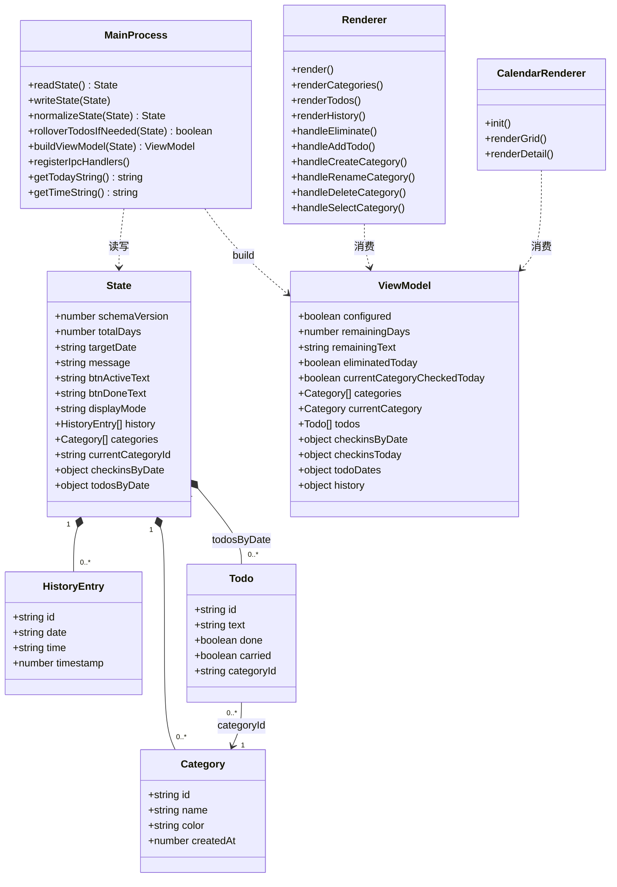
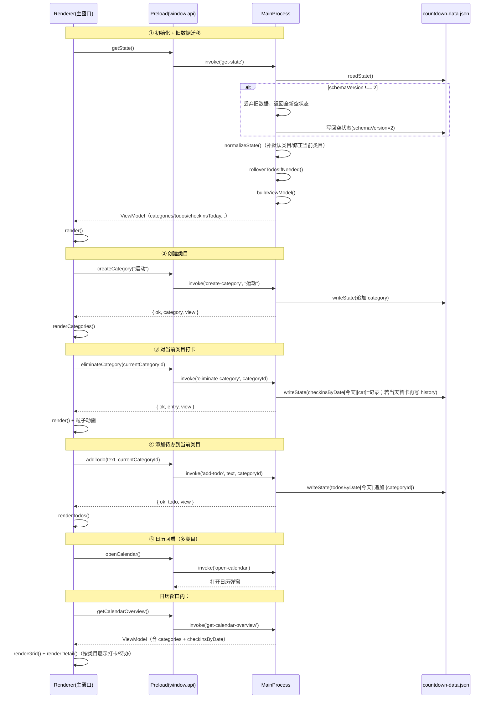
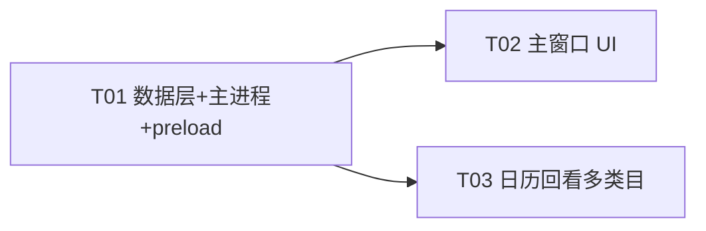

# 「倒数日」多打卡类目功能 —— 系统设计与任务分解

> 架构师：software-architect（Bob）
> 目标：在现有 Electron + 原生 JS 的「倒数日」应用上，新增「多打卡类目」能力。
> 原则：倒计时本身不变，类目只影响「打卡」与「待办」的归属；沿用珊瑚红主题与现有交互；旧数据清空重来。

---

# Part A：系统设计

## 1. Implementation Approach

### 1.1 核心难点分析

| 难点 | 说明 | 处理策略 |
|------|------|----------|
| **倒计时与打卡解耦** | 原 `history[]` 同时承担「天级递减」与「打卡记录」双重职责；现在打卡变成「按类目每天一次」，但剩余天数仍需按自然日每天最多递减 1 次 | 保留 `history[]` 作为「天级打卡/递减」记录（每天最多一条），新增 `checkinsByDate` 作为「类目级打卡」记录；当天**第一次**任一类目打卡时同时写入一条 `history`，从而保证剩余天数每天只减 1 |
| **待办归属类目** | 现有 `todosByDate` 中待办无类目概念 | 待办增加 `categoryId` 字段；今日待办列表只显示「当前选中类目」的待办；跨天顺延时保留 `categoryId` |
| **旧数据清空重来** | 现有数据文件无版本号，`readState()` 用浅合并兜底 | 引入 `schemaVersion`；读取时检测版本不符则丢弃旧数据、写入全新空状态，引导用户重新设置 |
| **类目管理 UI 空间受限** | 主窗口仅 300px 宽、悬浮条仅 60px 高 | 类目选择用「彩色 chips 横排 + 末位 ＋ 号」紧凑呈现，悬浮条按钮文案直接带当前类目名 |
| **日历回看多类目** | 日历目前只有「当天一条 ✓」 | 网格保留「当日是否有打卡」的单一 ✓；详情区改为按类目逐条展示打卡时间；待办详情带类目色标 |

### 1.2 框架与选型

- **不引入任何新依赖**：继续使用 Electron 30 + 原生 JS（无前端框架），与现有技术栈完全一致。
- 数据持久化沿用 `app.getPath('userData')/countdown-data.json` 的 JSON 文件读写。
- 架构模式：延续现有「主进程（数据+IPC） / preload（安全桥） / 渲染进程（UI） / 日历弹窗」分层，仅扩展数据模型与 IPC 面。

### 1.3 关键设计决策（与需求逐条对应）

1. **倒计时不变**：`totalDays / targetDate / remainingDays / remainingText / eliminatedCount` 的计算逻辑**完全不变**，仍以 `history.length` 为「已打卡天数」。
2. **每类目每天独立打卡**：新增 `checkinsByDate[date][categoryId] = { time, timestamp }`，天然保证「每类目每天一条」。
3. **待办归属类目**：`Todo` 增加 `categoryId`；添加待办默认挂到当前选中类目。
4. **打卡按钮语义**：`消除今天` → `对当前选中类目打卡`（新 handler `eliminate-category`）。
5. **旧数据清空**：`schemaVersion` 门禁 + 迁移时写回全新空状态。

---

## 2. File List

```
countdown-app/
├── main.js            # 改：数据模型、迁移、IPC handler（核心）
├── preload.js         # 改：暴露新 API、调整 addTodo/eliminate 签名
├── renderer.js        # 改：类目选择 UI、打卡/待办归属交互
├── index.html         # 改：下拉面板新增「类目选择条」结构
├── styles.css         # 改：类目 chips / 色点 / 新增类目输入框样式
├── calendar.js        # 改：详情区按类目展示打卡与待办
├── calendar.css       # 改：类目打卡项 / 类目标签样式
├── calendar.html      # 改（轻微）：标题「待办回看」→「打卡回看」
├── README.md          # 改：补充新数据模型与功能说明
└── docs/
    ├── system_design.md          # 本文档
    ├── class-diagram.mermaid     # 类图
    └── sequence-diagram.mermaid  # 时序图
```

无新增源文件、无新增依赖。

---

## 3. Data Structures and Interfaces

### 3.1 新数据模型（DEFAULT_STATE 完整结构）

```jsonc
{
  "schemaVersion": 2,          // 数据版本号；≠2 的旧数据将被清空重建
  "totalDays": 0,              // 总天数（不变）
  "targetDate": "",            // 目标日期 YYYY-MM-DD（不变）
  "message": "",               // 含义文字（不变）
  "btnActiveText": "",         // 按钮未打卡文字（不变）
  "btnDoneText": "",           // 按钮已打卡文字（不变）
  "displayMode": "days",       // days | months | years（不变）

  "history": [],               // 天级打卡记录（倒计时递减依据，每天最多一条）
  // history 元素：{ "id": "2026-09-10_1720000000000", "date": "2026-09-10", "time": "08:30:00", "timestamp": 1720000000000 }

  "categories": [              // 打卡类目（新增）
    { "id": "cat_1720000000000_ab3x", "name": "运动", "color": "#ff6b5e", "createdAt": 1720000000000 }
  ],

  "currentCategoryId": "cat_1720000000000_ab3x",  // 当前选中类目（持久化，便于记忆）

  "checkinsByDate": {},        // 类目级打卡记录（新增）
  // 结构：{ "2026-09-10": { "cat_xxx": { "time": "08:30:00", "timestamp": 1720000000000 } } }

  "todosByDate": {}            // 待办（元素增加 categoryId）
  // 结构：{ "2026-09-10": [ { "id":"todo_...", "text":"跑步", "done":false, "carried":false, "categoryId":"cat_xxx" } ] }
}
```

### 3.2 字段口径（精确）

| 字段 | 类型 | 约束 | 说明 |
|------|------|------|------|
| `schemaVersion` | number | 恒为 `2` | 迁移门禁 |
| `history[]` | Array | 每天最多一条（按 `date` 去重） | 天级递减依据，`eliminatedCount = history.length` |
| `categories[]` | Array | **至少 1 个**（读取时自动补默认类目） | 类目 |
| `category.id` | string | `cat_<ts>_<rand>` | 唯一 |
| `category.name` | string | trim 后非空，≤ 12 字 | 展示名 |
| `category.color` | string | 珊瑚红系调色板 hex | 色点/标签 |
| `category.createdAt` | number | 时间戳 ms | 排序用 |
| `currentCategoryId` | string | 必须是 `categories` 中存在的 id（否则回退首个） | 当前类目 |
| `checkinsByDate` | object | `{ date: { categoryId: { time, timestamp } } }` | 类目级打卡 |
| `todosByDate[date][]` | Array | 元素含 `categoryId` | 待办归属类目 |

### 3.3 类目调色板（珊瑚红系，循环分配）

```
["#ff6b5e", "#ffa26b", "#f5a623", "#4caf7d", "#5b8def", "#8f6bf0", "#e056a0", "#4fb3bf"]
```
新增类目时按 `categories.length % 8` 顺序取色；用户暂不支持自选颜色（见「待明确项」）。

### 3.4 类图



### 3.5 IPC 接口设计

#### 3.5.1 新增 handler

| handler | 入参 | 返回 | 说明 |
|---------|------|------|------|
| `create-category` | `name: string` | `{ ok, category, view }` | 新建类目；name 非空/≤12；自动分配颜色；若为首个类目则设为当前 |
| `rename-category` | `id: string, name: string` | `{ ok, view }` | 重命名 |
| `delete-category` | `id: string` | `{ ok, view }` | 删除；**仅剩 1 个时拒绝**；同时清除该类目的打卡与待办 |
| `set-current-category` | `id: string` | `{ ok, view }` | 切换当前类目并持久化 |
| `eliminate-category` | `categoryId: string` | `{ ok, entry, view }` | 对指定类目打卡（替代原 `eliminate-today`） |

#### 3.5.2 修改的 handler

| handler | 变更点 |
|---------|--------|
| `get-state` | 触发旧数据迁移（清空）；`normalizeState`（补默认类目/修正 currentCategoryId）；返回扩展后的 view |
| `save-settings` | **保留 `categories` 与 `currentCategoryId`**；重置 `history/checkinsByDate/todosByDate`（新倒计时重新开始，沿用旧行为：历史清空） |
| `add-todo` | 签名 `(text, categoryId)` → 待办写入 `categoryId`；缺省回退 `currentCategoryId` → 首个类目 |
| `reset-history` | 语义扩展为：清空 `history` **与** `checkinsByDate`（保留类目与待办） |
| `toggle-todo` / `delete-todo` | 签名不变，内部按 `id` 操作（待办已含 categoryId），返回新 view |
| `get-todos-by-date` | 签名不变，返回的 todo 含 `categoryId` |
| `get-calendar-overview` | 返回扩展 view（含 `categories` + `checkinsByDate`） |

#### 3.5.3 不动的 handler

`open-calendar`、`close-calendar`、`drag-window`、`set-panel-open`、`show-context-menu` 完全不变。

#### 3.5.4 preload.js 暴露的新 API

```js
createCategory: (name) => ipcRenderer.invoke('create-category', name),
renameCategory: (id, name) => ipcRenderer.invoke('rename-category', id, name),
deleteCategory: (id) => ipcRenderer.invoke('delete-category', id),
setCurrentCategory: (id) => ipcRenderer.invoke('set-current-category', id),
eliminateCategory: (categoryId) => ipcRenderer.invoke('eliminate-category', categoryId),
addTodo: (text, categoryId) => ipcRenderer.invoke('add-todo', text, categoryId)  // 签名调整
// 移除 eliminateToday
```

### 3.6 buildViewModel 新返回字段（在原有基础上）

```jsonc
{
  // —— 原有字段保留 ——
  "configured": true,
  "totalDays": 100,
  "targetDate": "2026-12-18",
  "message": "",
  "btnActiveText": "",
  "btnDoneText": "",
  "displayMode": "days",
  "remainingDays": 99,
  "remainingText": "99",
  "eliminatedCount": 1,
  "eliminatedToday": true,          // 天级：今天是否已有任一类目打卡
  "history": [ /* 天级记录 */ ],
  "todosByDate": { /* 全量待办 */ },
  "todoDates": { /* 每日 done/total（全类目合计，供日历圆点） */ },

  // —— 新增字段 ——
  "categories": [ { "id","name","color","createdAt" } ],
  "currentCategoryId": "cat_xxx",
  "currentCategory": { "id","name","color","createdAt" },   // 便利字段
  "checkinsByDate": { "2026-09-10": { "cat_xxx": { "time","timestamp" } } },
  "checkinsToday": { "cat_xxx": { "time","timestamp" } },    // 今日各类目打卡
  "currentCategoryCheckedToday": false,                      // 当前类目今日是否已打卡
  "todos": [ /* 仅「当前类目」的今日待办，供主面板渲染 */ ]
}
```

---

## 4. Program Call Flow

### 4.1 时序图（关键操作全流程）



### 4.2 `eliminate-category` 内部逻辑（关键分支）

1. `readState()` + `rolloverTodosIfNeeded(state)`。
2. 校验：`totalDays > 0`；`categoryId` 存在于 `categories`；该类目今日未打卡（`!checkinsByDate[today][categoryId]`）；`history.length < totalDays`。
3. 写入 `checkinsByDate[today][categoryId] = { time, timestamp }`。
4. 若 `history` 中今日无记录（**当天第一次打卡**）→ 追加一条天级 `history`，使 `remainingDays - 1`。
5. `writeState` + 返回 `buildViewModel`。

---

## 5. Anything UNCLEAR（待明确项）

| # | 待明确项 | 当前假设 |
|---|----------|----------|
| 1 | 删除类目时，该类目**历史打卡与待办**如何处理 | 假设：连同清除（前端 `confirm` 二次确认，标注「会清除该类目的待办与打卡记录」） |
| 2 | 「重置」按钮是否也清空类目与待办 | 假设：只清 `history + checkinsByDate`，保留类目与待办 |
| 3 | 「修改设置」（save-settings）是否保留类目 | 假设：保留类目；重置倒计时与待办（沿用现有「保存即重置历史」行为） |
| 4 | 倒计时完成后是否还允许继续打卡 | 假设：沿用现有——完成后禁止，提示「倒计时已全部完成 🎉」 |
| 5 | 添加待办时是否提供「选类目」下拉，还是默认当前类目 | 假设：默认当前类目（更简，符合「待办挂在该类目下」）；如需显式选择可后续加 |
| 6 | 类目数量上限 / 名称长度上限 | 假设：≤ 10 个类目、名称 ≤ 12 字 |
| 7 | 类目颜色是否允许用户自选 | 假设：固定珊瑚红系调色板循环分配，暂不自选 |
| 8 | 悬浮条按钮在窄宽度下如何展示类目名 | 假设：`打卡·{名称}`，名称超 4 字截断为「…」 |

---

# Part B：任务分解

## 6. Required Packages

```
无新增依赖。
现有 devDependencies 保持：
- electron@^30.0.0（桌面运行时）
- electron-builder@^24.13.3（打包）
```

## 7. Task List（按实现顺序，含依赖）

### T01 — 数据层与主进程改造（新数据模型 + 迁移 + IPC + preload）

- **Task ID**：T01
- **优先级**：P0
- **依赖**：无
- **Source Files**：`main.js`、`preload.js`、`README.md`

**具体改动点：**

`main.js`
1. `DEFAULT_STATE` 重写：新增 `schemaVersion: 2`、`categories: []`、`currentCategoryId: ''`、`checkinsByDate: {}`；`todosByDate` 元素增加 `categoryId`。
2. 新增常量 `SCHEMA_VERSION = 2`、`CATEGORY_COLORS`（8 色珊瑚红系调色板）。
3. `readState()` 改造：解析后若 `schemaVersion !== 2` → 丢弃旧数据，返回全新空状态（并标记需要写回）。
4. 新增 `normalizeState(state)`：`categories` 为空时补一个默认类目「打卡」；`currentCategoryId` 无效时回退到首个类目；保证 `checkinsByDate/todosByDate` 为对象。
5. `rolloverTodosIfNeeded()`：顺延的待办映射增加 `categoryId: t.categoryId`；删除旧的 `state.todos` 迁移分支（旧数据已由版本门禁清空）。
6. `buildViewModel()`：返回 3.6 节新增字段（`categories/currentCategoryId/currentCategory/checkinsByDate/checkinsToday/currentCategoryCheckedToday/todos(按当前类目过滤)`）；`todoDates` 保持全类目合计。
7. `registerIpcHandlers()`：
   - 新增 `create-category`、`rename-category`、`delete-category`、`set-current-category`、`eliminate-category`（实现见 4.2）。
   - 改 `get-state`（迁移写回）、`save-settings`（保留类目）、`add-todo`（categoryId）、`reset-history`（同时清 checkinsByDate）。
   - 删除 `eliminate-today`。
   - `toggle-todo`/`delete-todo`/`get-todos-by-date`/`get-calendar-overview` 保持签名、适配新字段。

`preload.js`
8. 新增 5 个 API（createCategory/renameCategory/deleteCategory/setCurrentCategory/eliminateCategory）。
9. `addTodo` 改为 `(text, categoryId)`；移除 `eliminateToday`。

`README.md`
10. 更新数据模型、类目功能、旧数据清空说明。

**验收标准**：`get-state` 返回含 `categories` 且至少 1 个类目；旧数据文件启动后被清空；`eliminate-category` 使 `remainingDays` 每天只减 1、同类目当天第二次打卡被拒。

---

### T02 — 主窗口 UI：类目选择 + 打卡 + 待办归属

- **Task ID**：T02
- **优先级**：P0
- **依赖**：T01
- **Source Files**：`index.html`、`renderer.js`、`styles.css`

**具体改动点：**

`index.html`
1. 在 `dropdown-panel` 内、`btn-eliminate` 上方新增「类目选择条」：
   ```html
   <div class="category-bar" id="category-bar">
     <div class="category-chips" id="category-chips"></div>
     <button class="category-add" id="category-add" type="button">＋</button>
   </div>
   ```
2. 悬浮条消除按钮文案预留 `打卡·{类目名}` 展示槽（由 JS 渲染）。

`renderer.js`
3. 新增 DOM 引用：`categoryChips/categoryAdd`。
4. 新增 `renderCategories()`：渲染 chips（色点 + 名称 + hover 删除「×」）；选中项高亮；末位 ＋ 号；点 chip → `handleSelectCategory(id)`；点 × → `handleDeleteCategory(id)`（confirm）；点 ＋ → 展开内联输入框 → `handleCreateCategory(name)`；双击 chip → 内联重命名 → `handleRenameCategory(id, name)`。
5. `render()`：按钮状态由 `currentCategoryCheckedToday`（当前类目）判断，替代 `eliminatedToday`；活跃文案 = `打卡·{当前类目名}`（btnActiveText 为空时）或 `{btnActiveText}`；已打卡文案 = `{btnDoneText || '已打卡'}`。
6. `handleEliminate()` → 调 `window.api.eliminateCategory(currentState.currentCategoryId)`。
7. `handleAddTodo()` → 调 `window.api.addTodo(text, currentState.currentCategoryId)`。
8. `handleToggleTodo/DeleteTodo` 保持按 id 调用（返回 view 后重渲染）。
9. `renderHistory()`：摘要保留「已打卡 N 天」，可追加「· M 个类目」。
10. `renderTodos()`：渲染当前类目待办（`currentState.todos` 已过滤），待办项可带类目色点（可选）。

`styles.css`
11. 新增 `.category-bar/.category-chips/.category-chip(.active)/.category-dot/.category-name/.category-del/.category-add/.category-input` 样式，沿用珊瑚红主题与圆角胶囊风格。

**验收标准**：可创建/切换/重命名/删除类目；打卡只作用于选中类目；待办默认挂到当前类目并只在当前类目下列出；两处按钮状态同步。

---

### T03 — 日历回看多类目展示

- **Task ID**：T03
- **优先级**：P1
- **依赖**：T01（可与 T02 并行）
- **Source Files**：`calendar.js`、`calendar.css`、`calendar.html`

**具体改动点：**

`calendar.js`
1. `init()`：从 `overview` 读取 `categories` 与 `checkinsByDate`，构建 `categoryById`（id→{name,color}）与 `categoryCheckins`（date→{categoryId:{time}}）。
2. 网格：保留现有「当日是否有打卡」的单一 ✓（仍由 `overview.history` 生成，逻辑不变）。
3. `renderDetail()` 打卡区：改为遍历 `categoryCheckins[selected]`，按类目逐条渲染「色点 + 类目名 + HH:MM:SS」；无打卡则不显示该 section。
4. `renderDetail()` 待办区：每个 todo 前渲染类目色标/名称小标签（用 `todo.categoryId` 查 `categoryById`；查不到则显示「已删除类目」灰色）。
5. 无任何记录时的空提示逻辑保持。

`calendar.css`
6. 新增 `.cal-detail-checkin-item/.cal-detail-cat-dot/.cal-detail-cat-tag` 样式（色点直径 ~8px，圆角；标签灰色底）。

`calendar.html`
7. 标题「待办回看」→「打卡回看」（窗口 title 与顶栏文案）。

**验收标准**：某天多类目打卡后，日历网格仍只显示一个 ✓，详情区按类目列出各打卡时间；待办详情带类目标签。

---

## 8. Shared Knowledge（跨任务共识）

- **数据文件**：`<userData>/countdown-data.json`，JSON 2 空格缩进；所有日期用本地时区 `YYYY-MM-DD`，时间为 `HH:MM:SS`。
- **版本门禁**：`schemaVersion === 2` 是唯一合法值；任何不等于 2 的存量数据启动时清空重建。
- **倒计时递减唯一依据**：`history.length`；`remainingDays = max(totalDays - history.length, 0)`。**只有当天第一次打卡写入 `history`**，多类目打卡不重复递减。
- **类目不变量**：`categories.length >= 1`（读取时自动补默认类目；删除时拒绝删最后一个）。
- **待办归属**：`add-todo` 缺省 `categoryId` 回退 `currentCategoryId` → 首个类目；跨天顺延必须保留 `categoryId`。
- **IPC 返回约定**：所有数据类 handler 返回 `{ ok, ...额外字段, view }`，`view` 始终为 `buildViewModel` 结果；渲染进程统一用返回的 `view` 覆盖 `currentState` 后 `render()`。
- **按钮状态判定**（主窗口两处按钮一致）：优先 `currentCategoryCheckedToday`（该类目今日已打卡 → disabled + doneText）；其次 `remainingDays <= 0` → disabled + `已完成 ✓`；否则 enabled + activeText。
- **不回归项**：倒计时/设置/重置/日历回看/拖动/托盘驻留/粒子动画全部保留。

---

## 9. Task Dependency Graph



- T02、T03 均只依赖 T01，二者可并行。
